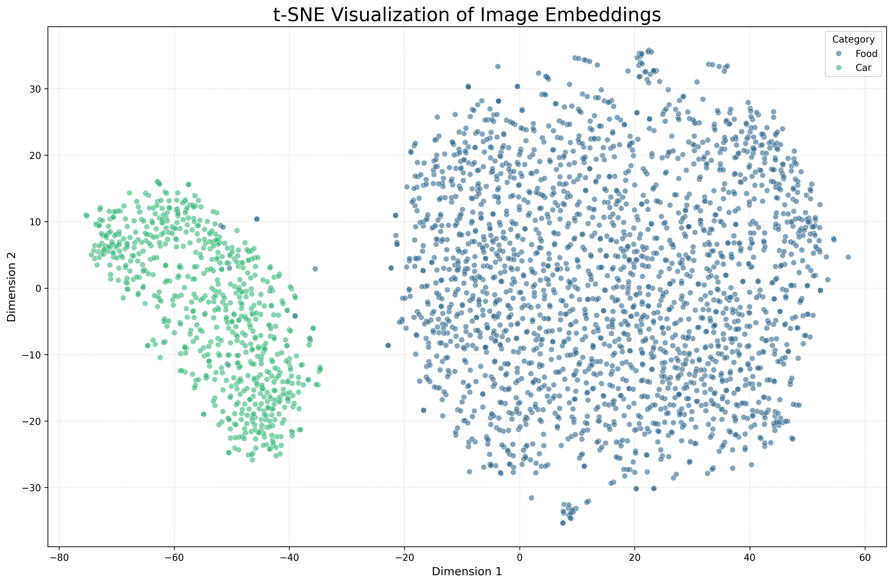

# 🍔🏎️ AI Similarity Search: Cars & Food

**An End-to-End Deep Learning Search Engine** capable of finding visually similar images across two distinct domains: Cars and Food.

**[🔴 LIVE DEMO LINK HERE - Paste your Streamlit Share link later]**

---

## 📌 Project Overview
This project leverages **Transfer Learning (MobileNetV2)** and **Triplet Loss** to build a visual search engine. Unlike traditional classifiers that just output a label (e.g., "Pizza"), this model learns a **128-dimensional embedding space** where similar items are grouped together.

* **Trained on:** 297 Classes (196 Cars + 101 Food Categories).
* **Dataset Size:** ~117,000 Images.
* **Infrastructure:** Trained on NVIDIA A2 GPU (Intel Unnati Program).

---

## 🚀 How to Use (Dual-Mode System)

Due to the large size of the full dataset (6.5 GB), this project is deployed with a "Dual-Mode" system.

### 🟢 Mode 1: Online Demo (Lite Version)
**Best for:** Quick testing and verification.
* The deployed web app runs on a **curated index of 25 diverse classes** (e.g., Ferrari, Pizza, Sushi, Hummer).
* **Why?** This allows the app to load instantly on the cloud without hitting storage limits.
* **How to test:** Simply upload an image of a popular car or food item (e.g., a slice of pizza or a red sports car) to see recommendations.

### 🔴 Mode 2: Full Version (Pro Version)
**Best for:** Deep evaluation of all 297 classes.
* To test the model's full capacity on all 33,000+ test images:

1.  **Clone this repository:**
    ```bash
    git clone [https://github.com/YOUR_USERNAME/AI-Visual-Search.git](https://github.com/YOUR_USERNAME/AI-Visual-Search.git)
    cd AI-Visual-Search
    ```

2.  **Download the Dataset:**
    * Download the merged dataset from Kaggle: [**Stanford Cars & Food-101 Merged Dataset**](https://www.kaggle.com/datasets/deep1705/stanford-cars-and-food-101-merged-dataset)
    * Unzip it and place the `dataset` folder in the root directory.

3.  **Run the App:**
    ```bash
    streamlit run 6_app_v2.py
    ```
    *The app automatically detects the full dataset and switches to "Pro Mode".*

---

## 🛠️ Technical Architecture

### 1. Model Training
* **Base Model:** MobileNetV2 (Pre-trained on ImageNet).
* **Strategy:** Transfer Learning with Fine-Tuning (Top 30 layers unfrozen).
* **Loss Function:** Triplet Margin Loss (Learning distance between Anchor, Positive, and Negative).
* **Optimizer:** Adam (Learning Rate: 0.0001).

### 2. Search Mechanism
* **Indexing:** All 33,000 test images are converted to 128D vectors.
* **Retrieval:** Cosine Similarity is used to find the "nearest neighbors" in vector space.

### 3. Visualization
We used **t-SNE** to project the 128D embeddings into 2D. As seen below, the model successfully separates the "Food" cluster from the "Cars" cluster.



---

## 📂 Repository Structure
* `6_app_v2.py`: The main Streamlit application.
* `embedding_model_v2.keras`: The trained Keras model (The "Brain").
* `mini_index.pkl`: The lightweight vector database for the online demo.
* `app_images/`: The small folder of images for the online demo.
* `_3_model.py`: Model architecture definition.

### 🔴 Mode 2: Full Version (Pro Version)
**Best for:** Deep evaluation of all 297 classes.
* To test the model's full capacity on all 33,000+ test images:

1.  **Clone this repository:**
    ```bash
    git clone [https://github.com/YOUR_USERNAME/AI-Visual-Search.git](https://github.com/YOUR_USERNAME/AI-Visual-Search.git)
    cd AI-Visual-Search
    ```

2.  **Download the Dataset:**
    * Download the merged dataset from Kaggle: [**Stanford Cars & Food-101 Merged Dataset**](https://www.kaggle.com/datasets/deep1705/stanford-cars-and-food-101-merged-dataset)
    * Unzip it. Ensure the folder named `dataset` (containing `train` and `test`) is inside the project root.

3.  **Generate the Local Index:**
    * Run the indexing script to scan the images and build the vector database on your machine:
    ```bash
    python 5_create_index_v2.py
    ```
    *(Note: This may take a few minutes as it processes 33,000 images).*

4.  **Run the App:**
    ```bash
    streamlit run 6_app_v2.py
    ```
    *The app will now detect the full dataset and switch to "Pro Mode".*